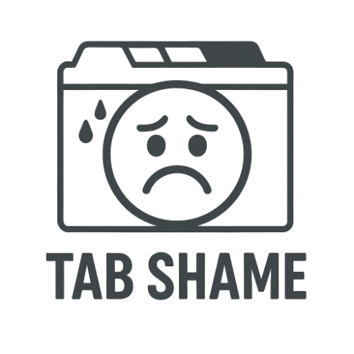

  

---
# Tab Shame

**Tab Shame** is a Chrome extension that helps you focus by making you think twice before opening too many tabs or windows. It gently nags you with custom quotes, and sounds.

## Features

- **Tab & Window Limits:** Set your own maximum for tabs and windows. Get a gentle nag if you go over.
- **Custom Nag Quotes:** Personalize the nag screen with your own motivational (or shaming) quotes.
- **Snooze Button:** Skip the nag for 10 minutes if you really need a break.
- **Mute Sounds:** Toggle nag sounds on or off.
- **Dark Mode:** Toggle dark mode for all UI screens.
- **Configurable Redirect:** Choose your start page for new tabs.
- **Keyboard Shortcut:** Quickly open the options page with <kbd>Alt</kbd>+<kbd>Shift</kbd>+<kbd>O</kbd>.
- **Accessibility:** Fully keyboard accessible and screen reader friendly.

## Installation (Developer Mode)

1. Download or clone this repository to your computer.
2. Open Chrome and go to `chrome://extensions`.
3. Enable **Developer mode** (toggle in the top right).
4. Click **Load unpacked** and select the folder where you saved Tab Shame.
5. The extension icon should appear in your Chrome toolbar.

## Demo Video

[Watch the demo video here](demo/tab-shame-demo.mov)

---

  

---

<b>For Andrea</b>

